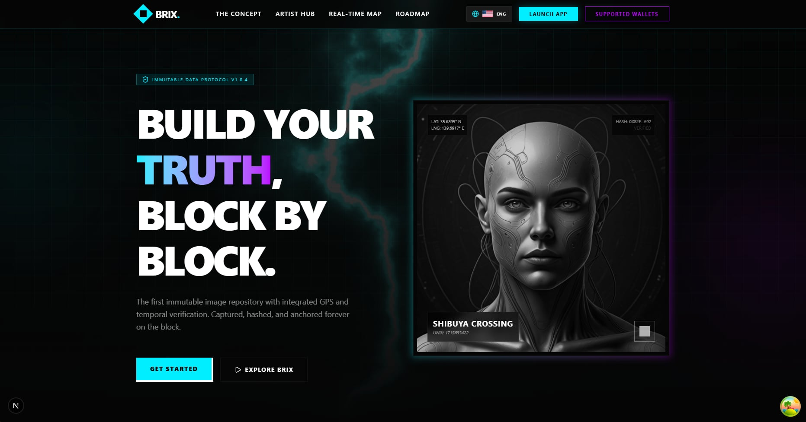
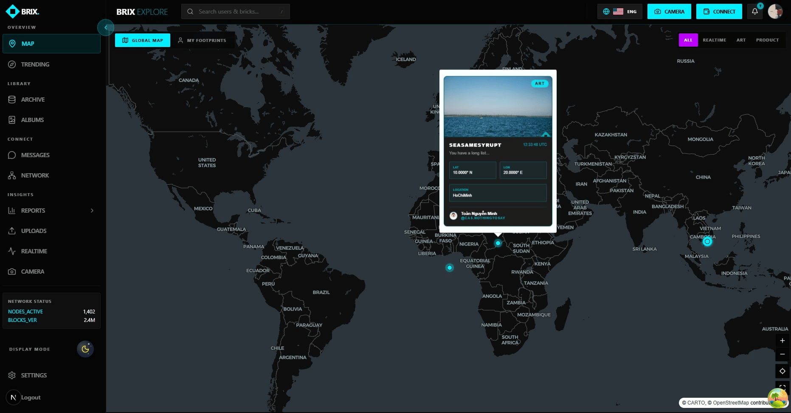
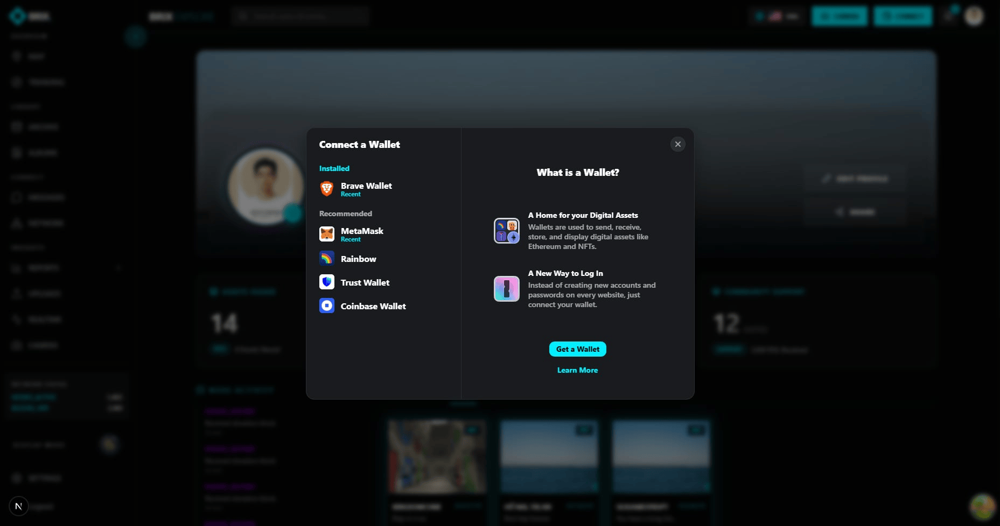
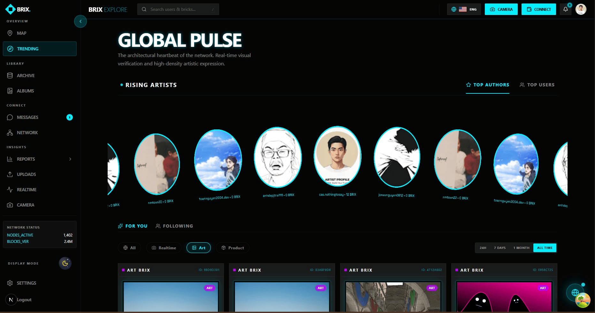

# BRIX Web

BRIX Web is the frontend for a location-aware social platform built around authenticated media, realtime image capture, and onchain-native interactions. Users can upload standard images, capture realtime images with GPS and nonce-based verification, publish 3D model posts, explore a global map of media activity, chat in realtime, create albums, and support creators through blockchain donations.

This repository contains the Next.js web client, deployment automation, and infrastructure workflow used to run the BRIX frontend across local, AWS, and Vercel environments.

## Stack Snapshot


## Screenshots

<div align="center">
  <table>
    <tr>
      <td></td>
      <td></td>
    </tr>
    <tr>
      <td></td>
      <td></td>
    </tr>
  </table>
</div>

## What BRIX Is

BRIX turns media posts into location-linked "bricks" that behave like social content with stronger provenance signals.

- Standard image uploads with GPS context
- Realtime camera capture with location tracking and backend nonce verification
- Optional IPFS distribution and onchain flows for verified realtime media
- 3D model publishing and immersive media presentation
- Social interactions including upvotes, downvotes, comments, replies, and sharing
- Realtime messaging and notifications
- Creator donations through smart contracts
- Album creation and artist-style profile experiences
- Global map exploration for media discovery

## Highlight Features

- Realtime image capture flow with countdown, GPS metadata, nonce verification, and verification status UI
- Standard art upload flow for media posting
- 3D GLB model upload flow with previews and metadata
- Brick detail pages with voting, threaded discussion, donation UI, and onchain status
- Global newsfeed and location-based discovery
- Interactive maps powered by MapLibre for capture, exploration, and geospatial UI
- Realtime messaging built on Socket.IO
- Notification center and presence-aware interactions
- Wallet connection support for Brave Wallet, Trust Wallet, MetaMask, Coinbase Wallet, and Rainbow
- Internationalization support with `next-intl`
- Custom visual experiences powered by ReactBits components and effects, including Liquid Ether and Infinite Menu

## Design Direction

The UI leans into an experimental, modern visual language rather than a generic dashboard style.

- ReactBits is used heavily for motion-rich components and visual effects
- `Liquid Ether` is used as a signature background treatment
- `Infinite Menu` is used as part of the immersive interaction layer
- Map-driven UX is a core part of the product, not just a secondary widget

References:

- [ReactBits](https://www.reactbits.dev/)
- [Liquid Ether](https://www.reactbits.dev/backgrounds/liquid-ether)
- [Infinite Menu](https://www.reactbits.dev/components/infinite-menu)

## Tech Stack

### Frontend

- Next.js 16 with App Router
- React 19
- TypeScript
- Tailwind CSS 4
- Motion, GSAP, OGL, Three.js, React Three Fiber, Drei

### State and Data

- TanStack Query for server state
- Zustand for client state
- Axios for API communication
- Zod and React Hook Form for form validation and input handling

### Maps and Search

- MapLibre GL for geospatial rendering
- Algolia for search experiences

### Auth, Realtime, and Integrations

- NextAuth v5 beta
- Socket.IO client
- Firebase client SDK
- `next-intl` for i18n

### Web3

- Wagmi
- Viem
- RainbowKit
- WalletConnect / Reown
- Polygon as the target Ethereum Layer 2 network

Current blockchain flows in this repository are configured for a testnet environment. The default chain setting is Polygon Amoy, which is used for ongoing development and integration testing before a mainnet-ready rollout.

### Tooling

- pnpm
- ESLint
- Prettier
- Husky
- lint-staged
- Commitlint

### Deployment and Ops

- Docker multi-stage production image
- GitHub Actions for CI/CD
- Ansible for application and server orchestration
- Terraform for EC2 lifecycle and remote state management
- Nginx as reverse proxy
- Portainer for container management

## Product Routes at a Glance

The app is organized around a few major route groups under [`src/app`](/F:/BRIX-Web/src/app):

- `(auth)` for login, signup, and recovery
- `(main)/dashboard` for feeds, uploads, artists, archive, realtime, notifications, settings, and network views
- `(main)/camera` for mobile-friendly realtime capture
- `(main)/messages` for realtime chat
- `album/[id]` for album pages
- `api/auth/[...nextauth]` for auth handling
- `api/health` for container and deployment health checks

## Project Structure

```text
.
├── .github/workflows/        # CI/CD workflows
├── ansible/                  # Deployment playbooks, templates, and inventory
├── locales/                  # Translation resources
├── public/                   # Static assets
├── scripts/                  # Utility scripts such as DNS updates
├── src/
│   ├── app/                  # App Router pages, layouts, API routes
│   ├── components/           # Feature-oriented UI components
│   ├── guards/               # Route and auth guards
│   ├── hooks/                # Custom hooks and API hooks
│   ├── i18n/                 # Internationalization setup
│   ├── lib/                  # API client, query client, shared config
│   ├── providers/            # App-level providers
│   ├── stores/               # Zustand stores
│   ├── types/                # TypeScript domain types
│   ├── utils/                # Utility functions
│   └── validations/          # Zod schemas
├── terraform/                # AWS infrastructure definitions
├── Dockerfile                # Production container image
├── next.config.ts            # Next.js configuration
└── package.json              # Scripts and dependencies
```

## Local Development

### Prerequisites

- Node.js 22 recommended
- pnpm 10

### Install

```bash
pnpm install
```

### Configure Environment

Create a local environment file from the example:

```bash
cp .env.example .env.local
```

Fill in the required values before starting the app.

### Run the Development Server

```bash
pnpm dev
```

The app will be available at `http://localhost:3000`.

### Useful Commands

```bash
pnpm dev
pnpm build
pnpm start
pnpm lint
pnpm type-check
pnpm format
pnpm analyze
```

## Environment Variables

The project includes example files:

- [`.env.example`](/F:/BRIX-Web/.env.example) for local/frontend runtime configuration
- [`.env.ci.example`](/F:/BRIX-Web/.env.ci.example) for CI/CD and deployment secrets

### Application Variables

```env
NODE_ENV=development
NEXT_PUBLIC_BACKEND_URL=http://localhost:8080
NEXTAUTH_SECRET=your-secret
NEXTAUTH_URL=http://localhost:3000
NEXTAUTH_SESSION_MAX_AGE=604800

NEXT_PUBLIC_FIREBASE_API_KEY=...
NEXT_PUBLIC_FIREBASE_APP_ID=...
NEXT_PUBLIC_FIREBASE_AUTH_DOMAIN=...
NEXT_PUBLIC_FIREBASE_MEASUREMENT_ID=...
NEXT_PUBLIC_FIREBASE_MESSAGING_SENDER_ID=...
NEXT_PUBLIC_FIREBASE_PROJECT_ID=...
NEXT_PUBLIC_FIREBASE_STORAGE_BUCKET=...

NEXT_PUBLIC_ALGOLIA_APP_ID=...
NEXT_PUBLIC_ALGOLIA_SEARCH_KEY=...

NEXT_PUBLIC_REOWN_PROJECT_ID=...

NEXT_PUBLIC_BRIX_CONTRACT_ADDRESS=...
NEXT_PUBLIC_TARGET_CHAIN_ID=80002
NEXT_PUBLIC_IPFS_FEE=0.01
NEXT_PUBLIC_PINATA_GATEWAY_URL=...
```

### What These Variables Are For

- `NEXT_PUBLIC_BACKEND_URL`: base URL of the backend API used by the web client
- `NEXTAUTH_*`: web authentication and session behavior
- `NEXT_PUBLIC_FIREBASE_*`: Firebase client configuration
- `NEXT_PUBLIC_ALGOLIA_*`: search and indexing integration
- `NEXT_PUBLIC_REOWN_PROJECT_ID`: wallet connectivity configuration
- `NEXT_PUBLIC_BRIX_CONTRACT_ADDRESS`: donation and onchain interaction target
- `NEXT_PUBLIC_TARGET_CHAIN_ID`: target blockchain network
- `NEXT_PUBLIC_IPFS_FEE`: UI-side fee display/configuration for IPFS-related actions
- `NEXT_PUBLIC_PINATA_GATEWAY_URL`: gateway used for distributed asset access

### CI / Deployment Variables

```env
AWS_ACCESS_KEY_ID=
AWS_SECRET_ACCESS_KEY=
NAME_COM_USERNAME=
NAME_COM_TOKEN=
REMOTE_HOST=
REMOTE_USER=
SSH_PRIVATE_KEY=
DOCKERHUB_USERNAME=
DOCKERHUB_ACTOKEN=
```

These values are used by GitHub Actions, Terraform, DNS automation, Docker image publishing, and Ansible-based deployment.

## CI/CD and Deployment Flow

GitHub Actions workflows live in [`.github/workflows`](/F:/BRIX-Web/.github/workflows).

### Continuous Integration

- `lint.yml`
    - installs dependencies
    - runs ESLint
    - runs TypeScript type-checking

- `commit-lint.yml`
    - validates commit messages on push and pull request events

### Continuous Delivery

- `pipeline.yml`
    - builds the Docker image
    - tags images by environment and commit SHA
    - pushes images to Docker Hub
    - deploys to AWS through Ansible
    - waits for health checks
    - supports rollback to the previous healthy image if deployment health fails

### Infrastructure Workflows

- `infra-create.yml` provisions or starts infrastructure with Terraform and updates DNS
- `infra-stop.yml` stops the EC2 instance
- `infra-destroy.yml` destroys infrastructure resources

## Hosting and Runtime URLs

Current web entry points:

- Production web: [https://aws.brix.social](https://aws.brix.social)
- Development web: [https://dev.brix.social](https://dev.brix.social)
- Portainer: [https://portainer.brix.social](https://portainer.brix.social)
- Vercel deployment: [https://vercel.brix.social](https://vercel.brix.social)

The AWS-hosted environments are fronted by Nginx and deployed through Docker + Ansible. Vercel can be used as an additional deployment target for the frontend.

## Infrastructure Notes

- Terraform manages the EC2 instance lifecycle and remote state backend
- Ansible handles Docker installation, shared infrastructure deployment, app deployment, and Nginx configuration
- Docker health checks use the `/api/health` endpoint
- The deployment flow now supports health validation and automatic rollback to the previous image when possible

## Frontend Architecture Notes

- Feature-first component organization keeps domain areas such as album, artist, camera, dashboard, messages, realtime, settings, and upload isolated
- Shared providers centralize auth, API token wiring, web3, sockets, queries, and i18n
- Maps are treated as a core domain primitive for capture and discovery, not just a visual extra
- The app combines product-style social interactions with web3-native donation and verification flows

## Related Runtime Expectations

This repository is the web frontend. It expects external services such as:

- a BRIX backend API
- authentication/session support
- Socket.IO namespaces for chat and notifications
- search indexing
- wallet-compatible blockchain endpoints
- optional IPFS / gateway infrastructure

## License

This project is currently private unless stated otherwise by the repository owner.
